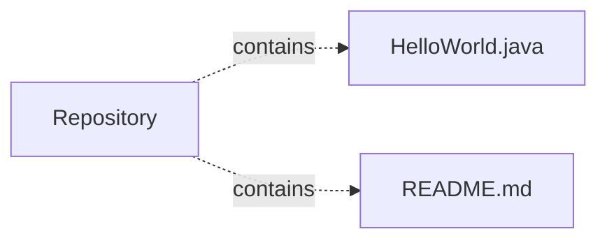

# myproject23Jan — project architecture

[README](README.md) · [Interview questions and answers](INTERVIEW_QA.md)

## Purpose and scope

A learning repository containing a Java Hello World example and files used to practice Git branches, merges, and collaboration.

This document describes files and symbols in this checkout. Deployment templates and statements in the original overview are distinguished from a verified running environment.

## Component diagram

For Python repositories, arrows show resolved local imports, not network calls or deployment order. Otherwise the diagram is a repository component map; containment arrows do not assert runtime integration.

## Components and responsibilities

| Component | Responsibility |
| --- | --- |
| [`HelloWorld.java`](HelloWorld.java) | Implementation or supporting configuration |
| [`README.md`](README.md) | Project explanations or operating notes |

## Setup and verification

Follow the existing README and the component-specific instructions linked above. No new application start command is asserted for this repository.

No dedicated test files were found in the inspected first-party file inventory. A future implementation should add executable acceptance checks.

## Operating boundaries and design review

Before turning this checkout into a customer deployment, establish the input contract, data ownership, access controls, failure response, evaluation criteria, and rollback owner. Repository fixtures and unit tests demonstrate local behavior; they do not establish throughput, uptime, compliance, or business impact.

A useful architecture review starts with the linked implementation: identify where input enters, where a decision is made, which state can change, and which external dependency can fail. Add a deployment view only for infrastructure that is actually configured and exercised.
